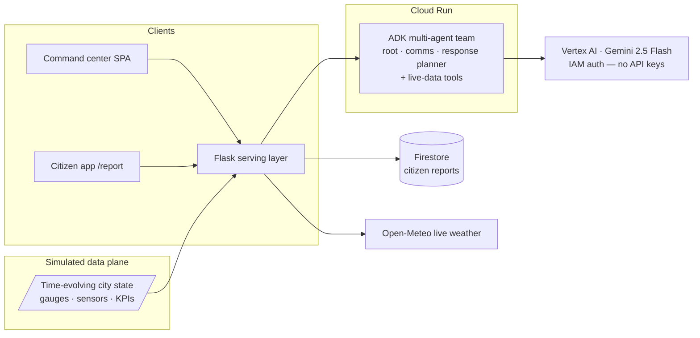

# ResilienceAI 🌊

**Decision intelligence for flood-resilient communities.**

An AI-powered flood early-warning and decision-intelligence platform for Southeast Asian river and coastal cities, built for the **Google Cloud Gen AI Academy APAC Edition** hackathon (Challenge 1 — AI for Better Living and Smarter Communities).

**🔴 Live demo:** https://resilienceai-16862175850.asia-southeast1.run.app
**📱 Citizen app:** https://resilienceai-16862175850.asia-southeast1.run.app/report

**Team rebiit** · Lim Kai Lun Axel

---

## The problem

Floods are APAC's costliest disaster. When a storm hits, city response teams lose precious hours stitching together river-gauge feeds, weather forecasts, and thousands of unstructured citizen reports — while the window to evacuate safely closes.

## What ResilienceAI does

It fuses sensor, weather, and citizen data into one live operational picture, then turns it into ranked, explainable decisions:

| Capability | What it does | Powered by |
|---|---|---|
| **Live Risk Map** | District-level flood-risk heat map, updated as state evolves | live `/api/state` |
| **72-hour Risk Forecast** | River & rainfall forecasts with confidence bands, plus a **real live rainfall feed** | Open-Meteo (live) |
| **AI Response Assistant** | Ask in natural language — an **ADK multi-agent team** (root + comms + planner) calls live-data tools and answers with a visible tool trace | ADK + Gemini 2.5 on Vertex AI |
| **Citizen Reports Triage** | Gemini multimodal classifies photo reports by type/severity, flags duplicates against the existing feed, and **persists them in Firestore** | Gemini on Vertex AI + Firestore |
| **Citizen mobile app** (`/report`) | Citizens snap a photo → AI classifies it → it lands in the operator queue with safety advice back to the citizen | Gemini on Vertex AI |
| **Ranked Action Recommendations** | One click regenerates the full ranked response plan **live**, grounded on current state + citizen reports | Gemini on Vertex AI |
| **What-If Scenario Simulator** | Adjust rainfall/storm track — risk recomputes instantly, and Gemini **re-plans the response for that scenario** | Gemini on Vertex AI |

**Responsible AI by design:** every public-facing action requires human confirmation, and every recommendation explains its reasoning and cites its data.

## Resilient by design

A flood platform that needs good bandwidth, mains power and healthy cell towers fails exactly when it is needed. Power is deliberately cut to flooded districts, networks congest rather than fail cleanly, and cell sites run on a few hours of battery. So the system degrades in layers:

| Failure mode | What still works |
|---|---|
| Congested or 2G network | Connection-aware compression: a report drops **378 KB → 33 KB** with identical AI classification |
| No connectivity at all | Reports are captured offline (service worker + IndexedDB), return immediate safety guidance, and flush automatically via Background Sync |
| A district goes dark | **Comms blackout detection** — silence is treated as escalation, not safety. The district is flagged as a blind spot with stale readings, and the agents dispatch a field team |
| AI layer unreachable | Explicit **degraded mode**: deterministic rule-based triage computed from live state, clearly labelled as not-AI — never canned text presented as intelligence |

Try it: the dashboard has a **comms-blackout drill** button, and `/report` works with the network switched off.

## Architecture



**What's real:** all Gemini calls (chat, triage, planning) run on **Vertex AI** with IAM service-identity auth — there is no API key anywhere in the stack. Citizen reports persist in **Firestore**. Weather comes live from **Open-Meteo**. The Assistant is a real **ADK multi-agent** system whose tool calls are shown in the UI.
**What's simulated:** Delta City itself — river gauges, sensors and KPIs are a deterministic time-evolving simulation (`/api/state`), clearly disclosed, so the operational scenario stays demonstrable year-round.

## Repo layout

```
prototype/index.html          # command center — self-contained single-file web app
prototype/report.html         # citizen mobile reporting app (offline-capable PWA)
prototype/sw.js               # service worker — offline shell + background sync
prototype/manifest.webmanifest
deploy/server.py              # Flask + ADK agents + Firestore + Vertex AI serving layer
deploy/Dockerfile             # Cloud Run container
deploy/requirements.txt
```

## Run locally

```bash
pip install -r deploy/requirements.txt
cp prototype/index.html prototype/report.html deploy/
GEMINI_API_KEY=<your-key> python deploy/server.py   # local dev fallback auth
# open http://127.0.0.1:8080
```

No key? The command center runs in demo mode with curated responses.

## Deploy to Cloud Run (production — Vertex AI, no API keys)

```bash
cp prototype/index.html prototype/report.html deploy/
gcloud services enable aiplatform.googleapis.com firestore.googleapis.com
gcloud firestore databases create --location=<region> --type=firestore-native
gcloud run deploy resilienceai --source deploy --region <region> \
  --allow-unauthenticated \
  --set-env-vars GOOGLE_CLOUD_PROJECT=<project>,VERTEX_LOCATION=global
# grant the service account roles/aiplatform.user + roles/datastore.user
```
