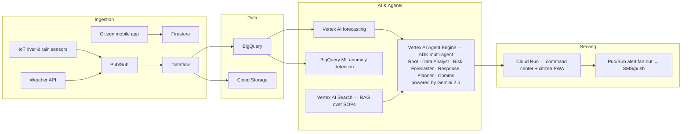

# ResilienceAI 🌊

**Decision intelligence for flood-resilient communities.**

An AI-powered flood early-warning and decision-intelligence platform for Southeast Asian river and coastal cities, built for the **Google Cloud Gen AI Academy APAC Edition** hackathon (Challenge 1 — AI for Better Living and Smarter Communities).

**🔴 Live demo:** https://resilienceai-16862175850.asia-southeast1.run.app
*(deployed on Cloud Run — the AI Response Assistant and photo triage are fully live, no setup needed)*

**Team rebiit** · Lim Kai Lun Axel

---

## The problem

Floods are APAC's costliest disaster. When a storm hits, city response teams lose precious hours stitching together river-gauge feeds, weather forecasts, and thousands of unstructured citizen reports — while the window to evacuate safely closes.

## What ResilienceAI does

It fuses sensor, weather, and citizen data into one live operational picture, then turns it into ranked, explainable decisions:

| Capability | What it does |
|---|---|
| **Live Risk Map** | District-level flood-risk heat map, updated as sensors stream |
| **72-hour Risk Forecast** | River & rainfall forecasts with confidence bands (Vertex AI) |
| **AI Response Assistant** | Ask in natural language, get grounded answers citing live data (Gemini 2.5) |
| **Citizen Reports Triage** | Gemini multimodal classifies photo reports by type/severity, flags duplicates |
| **Ranked Action Recommendations** | Prioritized actions with reasoning, population impact, confidence |
| **Multilingual Public Advisories** | One-click alerts in English + Bahasa, human-confirmed before broadcast |
| **What-If Scenario Simulator** | Adjust rainfall/storm track — risk and plan recompute instantly |

**Responsible AI by design:** every public-facing action requires human confirmation, and every recommendation explains its reasoning and cites its data.

## Architecture



The prototype in this repo implements the serving layer end-to-end (deployed on Cloud Run) with a realistic simulated data plane; Gemini calls are real and run server-side so the browser never sees an API key.

## Repo layout

```
prototype/index.html   # the command center — self-contained single-file web app
deploy/server.py       # Flask backend: serves the app + proxies Gemini (/api/chat, /api/triage)
deploy/Dockerfile      # Cloud Run container
deploy/requirements.txt
```

## Run locally

```bash
pip install -r deploy/requirements.txt
cp prototype/index.html deploy/index.html
GEMINI_API_KEY=<your-key> python deploy/server.py
# open http://127.0.0.1:8080
```

No key? The app runs in demo mode with curated responses. You can also open `prototype/index.html` directly in a browser (file://) and paste a Gemini API key via the settings gear.

## Deploy to Cloud Run

```bash
cp prototype/index.html deploy/index.html
gcloud run deploy resilienceai --source deploy --region asia-southeast1 \
  --allow-unauthenticated --set-env-vars GEMINI_API_KEY=<your-key>
```
